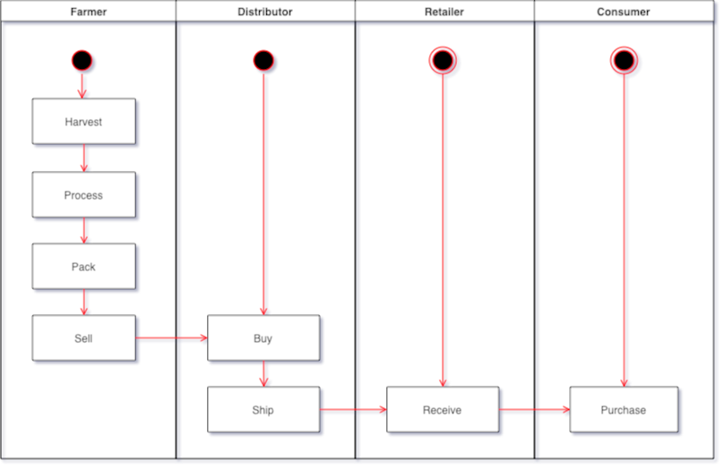
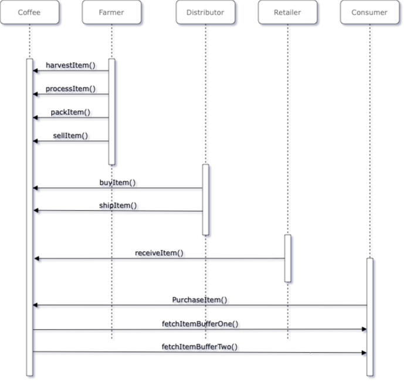
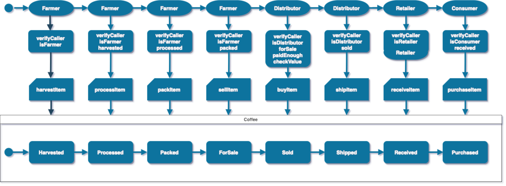
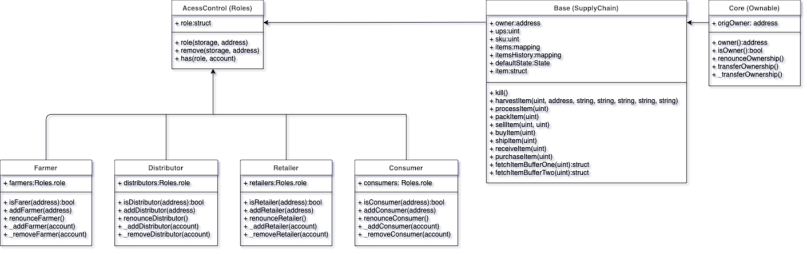
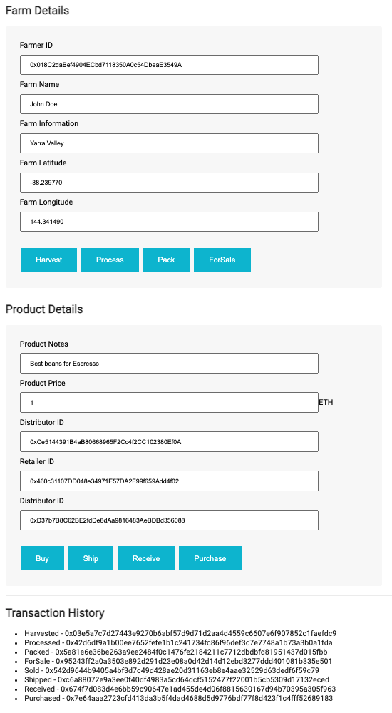

# Introduction
This repository containts an Ethereum DApp that demonstrates a Supply Chain flow between a Seller and Buyer. The user story is similar to any commonly used supply chain process. A Seller can add items to the inventory system stored in the blockchain. A Buyer can purchase such items from the inventory system. Additionally a Seller can mark an item as Shipped, and similarly a Buyer can mark an item as Received.

# Contract address
The contract is deployed at Rinkeby test network and the address is 0x6708966d8e6b4b312eb40c8b6efc29595d7eae22

# UML diagrams

##
 *Activity diagram*


 *Sequence diagram*

 *State diagram*

 *Classes diagram (Data Model)*

# Libraries

This project uses the web3 library to interract with the network.

This project uses web3 v0.20.x and truffle 4.x. 

You will get many errors if you try to run the project with web3 v1.x or truffle >v5.x.

# Project architecture.

## Contract
Tha basic architecture is described in the UML diagrams. 
Seven files, besides Migrations.sol, are used for full contract functionality.
Ownable.sol - This contract cantains the functionality needed to assign a contract owner and it also include functionality that allows ownership transfer.

Roles.sol - This library includes common role management functionality.

FarmerRole.sol, DistributorRole.sol, RetailerRole.sol - These files include all functionality for each role, includind assigning a role to an address or renouncing it.

SupplyChain.sol - This is the main contract that includes the needed funtionality. It combines the functionality of all other contracts.

## Tests
All tests are implemented in TestSupplychain.js. 
10 tests are implemented. There is a test for each important function of the contract.

You may run the tests using the command:
```
truffle test
```

# Instructions

## Prerequisites

This project requires that you have [nodejs](https://nodejs.org/en/) installed.
npm install web3@0.20.7 

Then, you need truffle, version 4.x. Versions 5.x and later will not work.

```
npm install -g truffle@4.1.5
```

You also need web3, v0.20.x. 

```
 npm install web3@0.20.7   
```
 
Finally, you should have [Metamask](https://metamask.io) and [Ganache](https://www.trufflesuite.com/ganache) installed. 

## How to run

Clone the repository to your computer.
```
git clone https://github.com/StavrosD/Udacity-Blockchain_Developer-Ethereum_Dapp_for_Tracking_Items_through_Supply_Chain.git
```

Run ganache to start a local blockchain server. In order to replicate exactly the same accounts for testing, use the the specific mnemoninc words.

```
ganache-cli -m "spirit supply whale amount human item harsh scare congress discover talent hamster"
```


Open a new terminal, enter the project folder and test that the contract works as expected.
```
truffle test
```

This command also includes "truffle compile".


## Migrate to local blockchain

You should deploy the contract locally for testing. 
```
truffle migrate
```
This command deploys the contracts to the local ganache server.

If you want to deploy to another network, such as the rinkeby test network , you can use the --network parameter.

```
truffle migrate --network rinkeby
```

Here is the expected output:
```
Debugger listening on ws://127.0.0.1:59229/e7cb5bcf-36ad-4d25-a1f2-d73066508e66
For help, see: https://nodejs.org/en/docs/inspector
Debugger attached.
Compiling ./contracts/coffeeaccesscontrol/ConsumerRole.sol...
Compiling ./contracts/coffeeaccesscontrol/DistributorRole.sol...
Compiling ./contracts/coffeeaccesscontrol/FarmerRole.sol...
Compiling ./contracts/coffeeaccesscontrol/RetailerRole.sol...
Compiling ./contracts/coffeeaccesscontrol/Roles.sol...
Compiling ./contracts/coffeebase/SupplyChain.sol...
Writing artifacts to ./build/contracts

Using network 'rinkeby'.

Running migration: 1_initial_migration.js
  Replacing Migrations...
  ... 0x1320b6f7bdab642c01b9fc69a9fef8755632dbecdc4b3d0ad5ad5cae436bbe7d
  Migrations: 0xb09e439d7d04637bf1897b70e07cccccbf77e292
Saving successful migration to network...
  ... 0xa916611a488877ab5e57f9e296814f9b9b24acbb0c4152794efd13b3553cadf4
Saving artifacts...
Running migration: 2_deploy_contracts.js
  Replacing FarmerRole...
  ... 0xb7f5078120f9a8b802b3268e700ba581f6a595f786630bcdab6fb905eb6d3d17
  FarmerRole: 0x9e52d8eafc46fb48feda1566995204759e62be4e
  Replacing DistributorRole...
  ... 0xa34ad1279ab28ba767e981dccb6a715a9df75da75eadfad22154de446221b097
  DistributorRole: 0x6ccb74f73f4f518e7b60c017fd4b0956aee7c138
  Replacing RetailerRole...
  ... 0x0a86d29957153c5f222103aebc78a48a47ad7cd9f44198be99992ca212a0a707
  RetailerRole: 0xb1010deaf9287235264808921ad953e6f703c536
  Replacing ConsumerRole...
  ... 0x0e6739c321c876c6433ac2a35c0dda669cae5acd3eff46c73ba382bbe3aac22d
  ConsumerRole: 0x8becc9336c6a9efeab4d3112ed2a043d7963d899
  Replacing SupplyChain...
  ... 0x1db6afd5d2986e27c3ff954665f1e7221b4059195e34b9a81a491351a8f02813
  SupplyChain: 0x6708966d8e6b4b312eb40c8b6efc29595d7eae22
Saving artifacts...
Waiting for the debugger to disconnect...
```
# Addresses

If you used the predefined mnemonic described above, the following addresses are available.
You may open Metamask and import each account using the private key.

Contract Owner: accounts[0]  
Address: DF0x27D8D15CbC94527cAdf5eC14B69519aE23288B95 
Private key: 0x9137dc4de37d28802ff9e5ee3fe982f1ca2e5faa52f54a00a6023f546b23e779

Farmer: accounts[1]  
Address: 0x018C2daBef4904ECbd7118350A0c54DbeaE3549A
Private key: 0x18911376efeff48444d1323178bc9f5319686b754845e53eb1b777e08949ee9b

Distributor: accounts[2]  
Address: 0xCe5144391B4aB80668965F2Cc4f2CC102380Ef0A
Private key: 0xf948c5bb8b54d25b2060b5b19967f50f07dc388d6a5dada56e5904561e19f08b

Retailer: accounts[3]  
Address: 0x460c31107DD048e34971E57DA2F99f659Add4f02
Private key: 0xf948c5bb8b54d25b2060b5b19967f50f07dc388d6a5dada56e5904561e19f08b

Consumer: accounts[4]  
Address: 0xD37b7B8C62BE2fdDe8dAa9816483AeBDBd356088
Private key: 0x19d1242b0a3f09e1787d7868a4ec7613ac4e85746e95e447797ce36962c7f68b

At least the first account should be imported. This account is the owner of the contract ana it is assigned with all the required roles. Before testing this Dapp, add the contract import the owner account in metamask using the private key. The Dapp will not execute if you use another account.

# How to run this DApp
After deploying the contracts to the ganache server, use npm to start the DApp.
```
npm run dev
```

You should have Metamask installed to run the DApp. 
A new browser will open and you should open metamask and select the local network (Localhost:8545).

Select the contract owner account and then use the buttons:
- Harvest
- Process
- Pack
- ForSale
- Buy
- Ship
- Receive
- Purchase

## Expected output

 *DApp UI*

